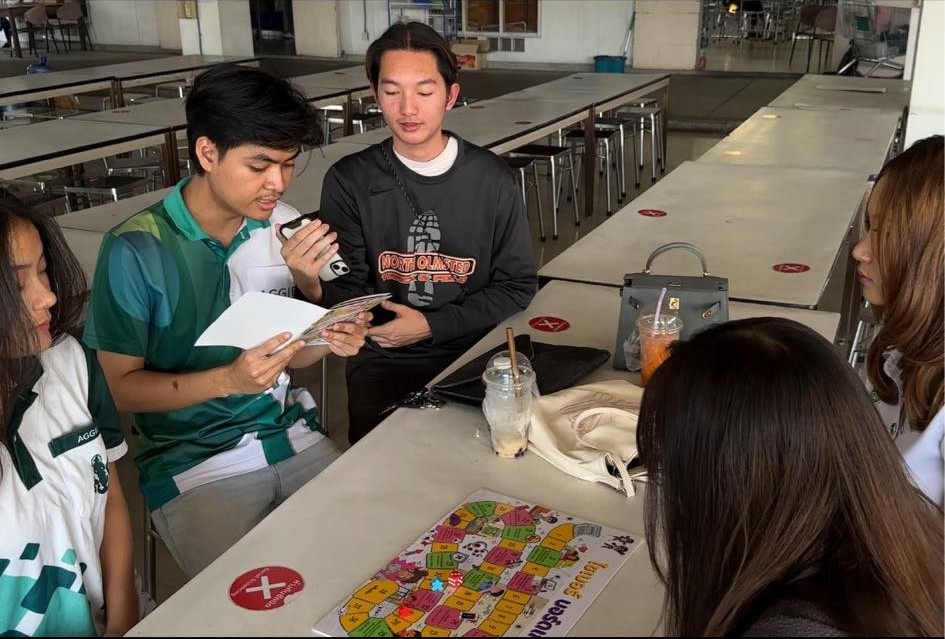

#6530200525

Grop "ก๊อง v.3"

เมื่อวันที่ 7 มกราคม 2568 ที่ผ่านมา ณ เวลา 14.00 น. ที่โรงอาหาร มหาวิทยาลัยเกษตรศาสตร์ วิทยาเขตศรีราชา

“กลุ่มก๊อง V3” นิสิตคณะวิทยาศาสตร์ ศรีราชา สาขาวิทยาการคอมพิวเตอร์ ได้จัดกิจกรรมส่งเสริมความรู้ด้านการรักษาความปลอดภัยไซเบอร์ โดยใช้บอร์ดเกมที่พัฒนาขึ้นโดย สกมช. เพื่อสร้างความเข้าใจและตระหนักรู้ในกลุ่มนิสิตภายในมหาวิทยาลัย

กิจกรรมในครั้งนี้ได้รับความสนใจเป็นอย่างดีจากนิสิตคณะวิทยาการจัดการ สาขาธุรกิจระหว่างประเทศ ซึ่งมีผู้เข้าร่วมที่สนใจเข้าร่วมเล่นเกมจำนวน 3 คน ทุกคนให้ความร่วมมือและมีส่วนร่วมในกิจกรรมอย่างน่าชื่นชม นอกเหนือจากการสร้างความสนุกสนานผ่านการเล่นเกมแล้ว ผู้เข้าร่วมยังได้ร่วมกันแลกเปลี่ยนความคิดเห็นในประเด็นสำคัญเกี่ยวกับหลักการและแนวทางปฏิบัติในการรักษาความปลอดภัยทางไซเบอร์ ตลอดจนการปฏิบัติตามกฎหมายที่เกี่ยวข้อง

จุดเด่นของกิจกรรมนี้อยู่ที่การมอบโอกาสให้ทุกคนได้ตระหนักถึงความสำคัญของการป้องกันภัยคุกคามในโลกดิจิทัล ไม่ว่าจะในมุมมองของคนรุ่นใหม่หรือผู้ใหญ่ การเสริมสร้างความเข้าใจเกี่ยวกับความเสี่ยงและแนวทางการรับมืออย่างเหมาะสม เป็นสิ่งสำคัญที่ช่วยให้ผู้เข้าร่วมสามารถนำความรู้ไปปรับใช้ในชีวิตประจำวันได้ กิจกรรมนี้จึงไม่เพียงแค่ให้ความบันเทิง แต่ยังเป็นเวทีในการพัฒนาความรู้และปลูกฝังความตระหนักรู้ในประเด็นสำคัญของยุคดิจิทัลให้กับผู้เข้าร่วมทุกคนอีกด้วย

สมาชิก นายสรสิช ปัญญางค์ :[https://bossmahob.github.io/cyberboardgame.html]

สมาชิก นายชลสิทธิ์ กิจกุลพิเชฐ :[https://markchonlasit.github.io/chonlasitK.github.io/boardgame]
