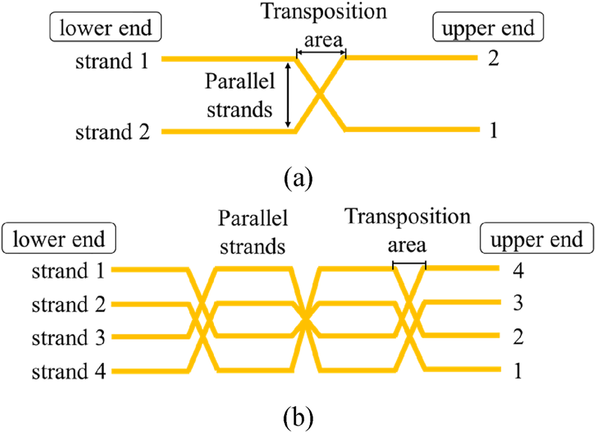
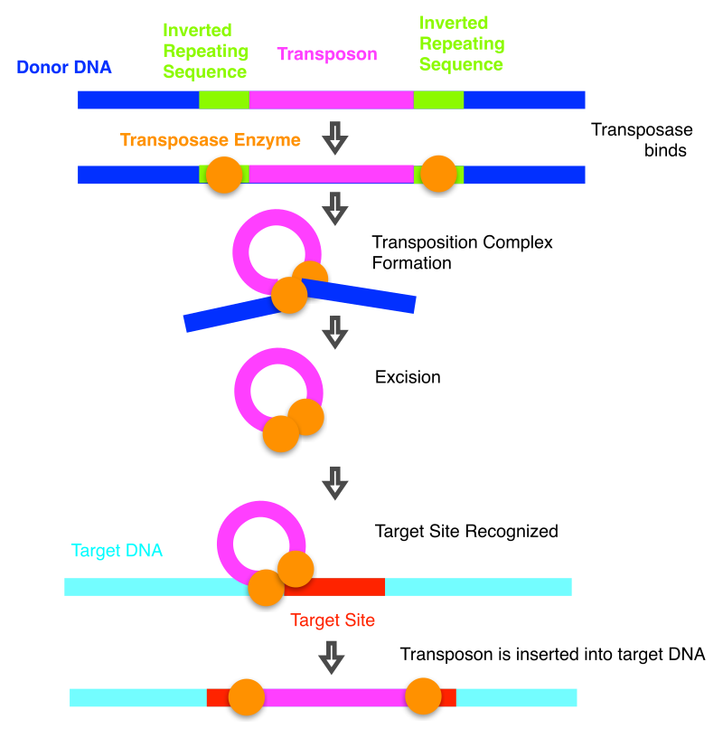

-👉Keyword:Tranposition👈

-Tranposition : The process of reordering the plaintext to hide the message by using the -same letters or bits.

-🤖Gemini : การย้ายที่เปลี่ยนตำแหน่ง หรือการเคลื่อนย้ายสิ่งของข้อมูลหรือแม้แต่แนวคิดจากที่หนึ่งไปยังอีกที่หนึ่ง
-🤖Chatgpt : การสลับที่มีความหมายหลายอย่างขึ้นอยู่กับบริบท โดยทั่วไปหมายถึงการเปลี่ยนตำแหน่งหรือการจัดเรียงใหม่ของสิ่งต่าง ๆ ในลักษณะต่าง ๆ
- -----------------------------------
-2nd Source(Tranposition)wikipidia
-a permutation which exchanges two elements and keeps all others fixed

-🤖Gimini : กระบวนการจัดเรียงลำดับตัวอักษรหรือบิตของข้อความต้นฉบับใหม่ เพื่อซ่อนข้อความโดยใช้ตัวอักษรหรือบิตเดิม

-🤖Chatgpt : การเข้ารหัสแบบ Transposition Cipher ในวิชาเข้ารหัสลับ (Cryptography) ซึ่งเป็นวิธีการเข้ารหัสที่ตำแหน่งของตัวอักษร (หรือบิต) ในข้อความต้นฉบับ (Plaintext) ถูกจัดเรียงใหม่ตามระบบหรือรูปแบบที่กำหนดไว้ โดยตัวอักษรหรือบิตในข้อความจะยังคงเหมือนเดิม แต่ตำแหน่งจะเปลี่ยนไป
- -----------------------------------
-👤Myself : การสลับตำแหน่ง หรือ การเปลี่ยนลำดับ โดยเอาสิ่งหนึ่งไปไว้ที่ตำแหน่งของอีกสิ่งหนึ่ง

-👤Sample in Daily life : การจัดระเบียบสิ่งของ
  การจัดห้องหรือโต๊ะทำงาน=สลับตำแหน่งของสิ่งของที่ใช้บ่อยให้อยู่ใกล้มือ เพื่อความสะดวกในการหยิบใช้งาน เช่น วางเครื่องเขียนไว้ด้านหน้า และเอกสารที่ไม่ค่อยได้ใช้ไว้ด้านหลัง
  การจัดกระเป๋าเดินทาง=จัดตำแหน่งของสิ่งของสำคัญไว้ด้านบน เช่น หนังสือเดินทางหรืออุปกรณ์ชาร์จ เพื่อให้หาได้ง่ายเมื่อจำเป็น

URL งาน : [click link here](https://6530200088.github.io/tranposition.html)
